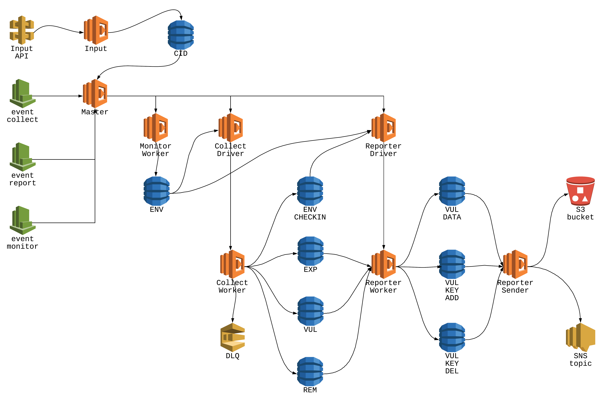

# Cloud Insight Vulnerability Notification

Sample architecture that utilize AlertLogic API to collect vulnerability state and notify when vulnerability added or removed. This sample will utilize AWS DynamoDB, Lambda, API Gateway, SNS and S3. You will be charged for AWS resource deployed from this example.



AlertLogic API end-point used in this demonstration:

* Cloud Insight API (https://console.cloudinsight.alertlogic.com/api/#/)

## Requirements
* Alert Logic Account ID (CID)
* Credentials to Alert Logic Cloud Insight (user name and password, or access key and secret key)
* Cloud Insight Deployment in the target CID

## Getting Started
Use the [CFT template](/cloud_formation) to launch the solution. The master stack will launch 4 nested child stack.

The Master lambda function will periodically query DynamoDB table called `CID Map` to find target CID to execute. By default this table will be empty and you need to fill it with CID info.

From the master CFT stack, grab the output `SNS topic` and `S3 bucket` value. The `S3 bucket` will store result from all checks and the `SNS topic` can be use to subscribe to the notification.

From the master CFT stack, grab the output `APIKey` and `RegisterURL`, use it to make POST request to register new Customer ID (CID) into `CID Map` table.

### Sample POST:
```
export APIKEY_TOKEN="my_api_key"
export APIKEY_HEADER="X-Api-Key:"
export APIKEY_HEADER+=$APIKEY_TOKEN
curl -X POST -d @payload.json -H "Content-Type: application/json" -H "Accept: application/json" -H $APIKEY_HEADER "https://w5iguju3u0.execute-api.us-east-1.amazonaws.com/prod/register" | jq "."
```

### Sample payload:
```
{
  "id": "my_target_cid",
  "user": "my_cloud_insight_user",
  "password": "my_cloud_insight_user",
  "parent_cid": "2",
  "yarp": "api.cloudinsight.alertlogic.com",
  "output": "S3",
  "sns_arn": "my_target_sns",
  "s3_bucket": "my_target_s3",
  "ttl": "90",
  "filter": {
    "min": "1",
    "max": "10"
  },
  "driver": "register",
  "source": "aws.apigateway"
}
```
### Notification
If you want to receive notification, subscribe to the SNS Topic either via email end points or other prefered method. You can also download the results in text file from the S3 bucket.

## Contributing
This sample will be provided AS IS with no long term support, please provide PR to contribute.

## License and Authors
License:
Distributed under the Apache 2.0 license.

Authors:
Welly Siauw (welly.siauw@alertlogic.com)
